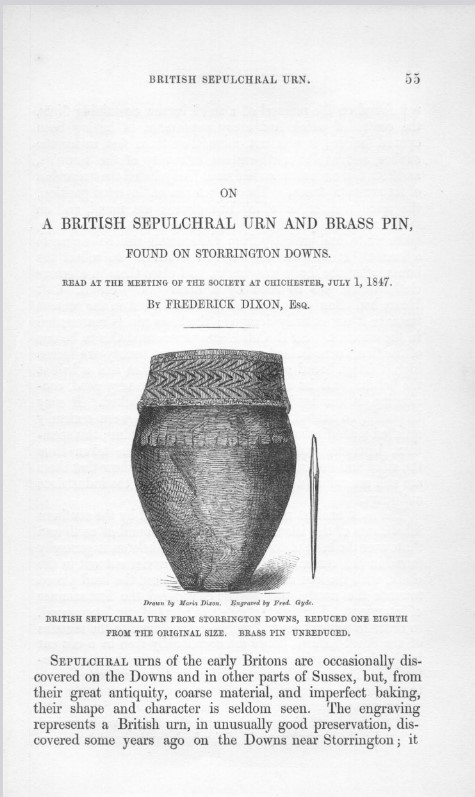
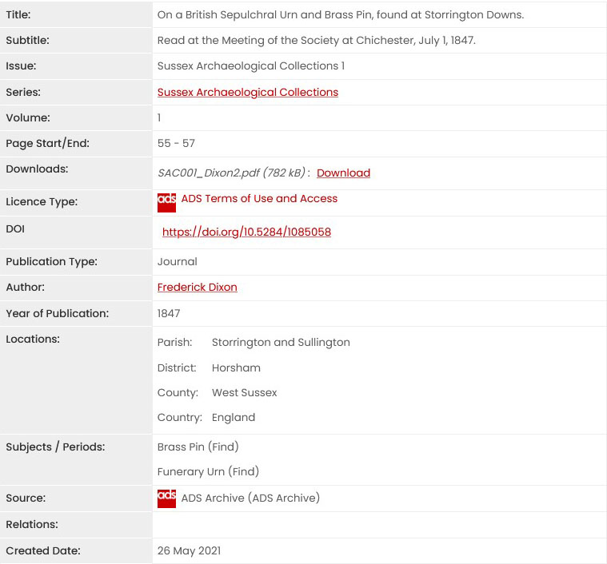
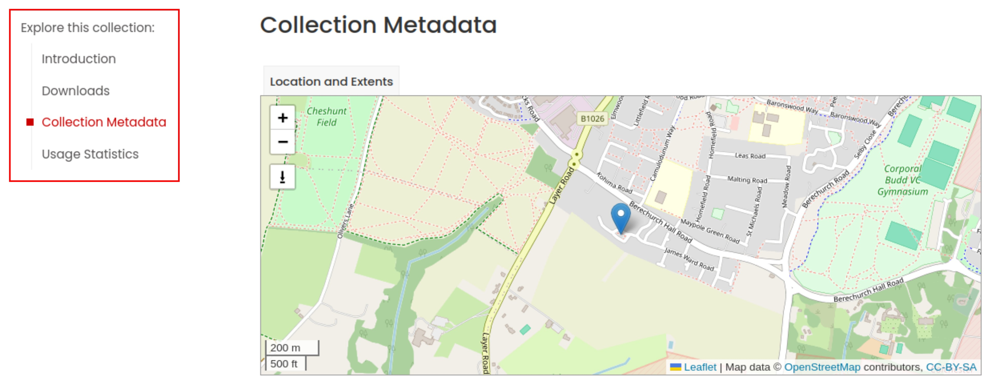
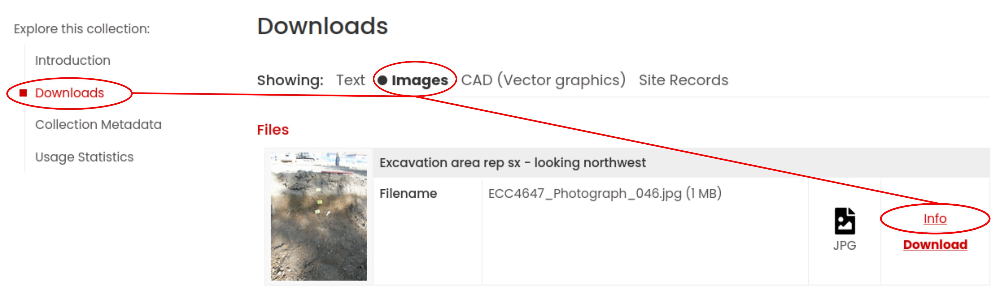

## Praktische Bezüge

Egal, ob für die eigene Datenablage, für eine Publikation von Forschungsergebnissen oder für die gemeinsame Arbeit mit Kolleg:innen an einem Projekt: Metadaten sind unerlässlich, um beispielsweise Projektdaten zu finden, sie zu verstehen, sie einordnen zu können und weiter zu nutzen. Metadaten beschreiben den Inhalt, die Entstehung und den Kontext von Daten. Sie machen einen Datensatz sowohl für **Menschen** als auch für **Maschinen** auffindbar und verständlich. Dabei gibt es unterschiedliche Arten von Metadaten, je nach Informationsbedürfnis und Anwendungskontext.

In dieser Übung vertiefen Sie Ihre Kenntnisse zu Metadaten und können anhand von Beispielen die unterschiedlichen Arten von Metadaten für verschiedene Dateitypen benennen, erläutern und auf eigene Daten anwenden. <!-- Holen Sie die Lernenden in diesem Absatz ab. Stellen Sie in wenigen Sätzen, mit Beispielen und Fragen das Thema des Bausteins vor. -->

### Voraussetzungen {.kolophon .unnumbered .unlisted}

Für das Verständnis dieser Übung werden vorausgesetzt:

-   Die Teilnehmenden sollten die verschiedenen Arten von Metadaten bereits benennen können. Eine Einführung zu den verschiedenen Arten von Metadaten [finden Sie unter diesem Link]().

<!-- Versuchen sie so detailliert wie möglich die Voraussetzungen für das Verständnis des Bausteins aufzuzählen. Geben sie Hinweise, wo die Lernenden entsprechende/s Kompetenzen/Wissen erwerben können. Damit sind nicht nur Kenntnisse im Forschunsdatenmanagement gemeint sondern auch Grund-Kompetenzen aus der Data Literacy und methodisch-praktische Kompetenzen gemeint. -->

## Datengrundlage

Die Beispiele für diese Übung stammen vom [Archaeology Data Service](https://archaeologydataservice.ac.uk/search-data/) (ADS).

## Aufgabenstellungen

### Aufgabe 1

In der ADS Library finden sich zahlreiche archäologische Zeitschriften, die retrodigitalisiert und mit Metadaten versehen sind. Schauen Sie sich einmal die Metadaten zu dem abgebildeten Artikel aus der Zeitschrift Sussex Archaeology an. [Dixon, F. (1847). On a British Sepulchral Urn and Brass Pin, found at Storrington Downs. Sussex Archaeological Collections 1. Vol 1, pp. 55-57](https://doi.org/10.5284/1085058).


::: panel-tabset
#### Aufgabenstellung

Schauen Sie sich das Titelbild der Zeitschrift und die zugehörigen Metadaten an: Welche verschiedenen Arten von Metadaten können Sie finden?. *Hinweis: Durch Klicken auf das Bild, können Sie es sich vergrößert ansehen.*

::::: columns

::: {.column width="35.6%"}



:::

::: {.column width="64.4%"}



:::
::::

#### Auflösung

| Metadatum | Metadatentyp | Erklärung |
|----|----|----|
| **Title** | Deskriptiv | Beschreibt den Inhalt |
| **Subtitle** | Strukturell | Beschreibt den Inhalt |
| **Issue** | Strukturell | Ordnet den Artikel innerhalb der Zeitschrift ein |
| **Series** | Strukturell | Ordnet den Artikel innerhalb von Publikationen ein |
| **Volume** | Strukturell | Ordnet den Artikel innerhalb der Zeitschrift ein |
| **Page Start/End** | Strukturell | Ordnet den Artikel innerhalb des Bandes ein |
| **Downloads** | Strukturell und technisch | Beschreibt, wie der Metadatensatz mit der Online-Ressource verbunden ist und gibt das Dateiformat an |
| **Licence Type** | Administrativ / Rechtlich | Beschreibt die rechtlichen Nutzungsbedingungen |
| **DOI** | Administrativ | Listet den eindeutigen persistenten Identifikator des Objekts auf |
| **Publication Type** | Deskriptiv | Schlagwort für die Art des Inhalts |
| **Author** | Deskriptiv | Angabe des Urhebers/ der Urheberin |
| **Year of Publication** | Deskriptiv | Angabe des Publikationszeitpunkts |
| **Location** | Deskriptiv | Inhaltliche Schlagworte |
| **Subjects / Periods** | Deskriptiv | Inhaltliche Schlagworte |
| **Source** | Administrativ / Strukturell | Gibt die Quelle, an der das Objekt liegt, an |
| **Created Date** | Administrativ / Erhaltungsbezogen | Gibt den Zeitpunkt an, zu dem der Metadatensatz erstellt wurde |

: Auflösung der Metadatentypen, die für den Artikel angegeben wurden mit Erklärung
:::

### Aufgabe 2

In der vorangegangenen Aufgabe wurden die Metadatentypen für einen Datensatz-Typ behandelt - einen wissenschaftlichen Aufsatz in einer archäologischen Zeitschrift. In der folgenden Aufgabe geht es um ein Projekt, in dem die unterschiedlichen Projektteile und Datensatz-Typen separat mit Metadaten versehen sind. Schauen Sie sich dafür den folgenden ADS-Datensatz an:

[Colchester Archaeological Trust (2025) Site Data from an Archaeological Evaluation at South of Berechurch Hall Road, Colchester, Essex, Sep 2021 [data-set]. York: Archaeology Data Service [distributor]](https://doi.org/10.5284/1132984).

- In der linken Übersichtsleiste finden Sie die Bereiche "Collection Metadata", in denen die Metadaten für die gesamte Kollektion angegeben sind. 



- Unter Downloads finden Sie verschiedene zugehörige Dateitypen, wie den [Bericht](https://archaeologydataservice.ac.uk/library/browse/issue.xhtml?recordId=1236039), [Rasterbilder](https://archaeologydataservice.ac.uk/archives/collections/view/1006589/downloads.cfm?archive=Image), [Vektorgraphiken](https://archaeologydataservice.ac.uk/archives/collections/view/1006589/downloads.cfm?archive=Site_Records) und [weitere Daten](https://archaeologydataservice.ac.uk/archives/collections/view/1006589/downloads.cfm?archive=Site_Records), die während der Ausgrabung aufgenommen wurden. 
- Für jede Datei können die Metadaten über *info* angezeigt werden.



::: panel-tabset
#### Aufgabenstellung

**Wie unterscheiden sich die Metadaten für die unterschiedlichen Dateiformate?**

#### Lösungshinweis

Verschiedene Dateiformate sind mit unterschiedlichen Metadaten versehen. Die **Rasterbilder und Vektorgraphiken** enthalten beispielsweise detaillierte **technische Metadaten** zu **Dateigröße, Dateiformat und Prüfsumme**. In den Metadaten der Rasterbilder sind nicht nur die Dateien selbst, sondern auch der **abgebildete Befund** ausführlich beschrieben. Die Metadaten des **Berichts** enthalten eine **längere Zusammenfassung** über den Inhalt. 

:::

### Ergebnisse
Es gibt eine Vielzahl an Metadaten, mit denen ein Objekt beschrieben werden kann. **Welche Metadaten aufgenommen werden, hängt davon ab, um welche Arten von Daten es sich handelt, die damit beschrieben werden.**

## Transferaufgabe
Denken Sie an eine aktuelle Forschungsarbeit, an der Sie arbeiten. Dies kann eine Hausarbeit fürs Studium sein, eine Abschlussarbeit, eine Projektarbeit oder ein Vortrag, den Sie vorbereiten müssen. Schreiben Sie auf:

1. Welche Dateiformate fallen bei dem Projekt an?
2. Überlegen Sie für jedes Dateiformat, welche Metadaten Sie hierfür aufnehmen können und welche Metadaten Sie für das gesamte Projekt aufnehmen können.
3. Suchen Sie sich ein Dateiformat heraus und überlegen Sie: Welche Metadaten sind für die Nachnutzbarkeit besonders entscheidend?

## Weiterführende Quellen und Informationen {.appendix .unnumbered}

Weitere Informationen zu Metadaten, den verschiedenen Typen von Metadaten sowie eine Sammlung mit Links zur weiteren Vertiefung in die Thematik finden Sie im [NFDI4Objects OER-Baustein Metadaten Einführung](). <!-- Der Ort für weiterführende Quellen und Informationen. Wenn Sie Fußnoten oder Literaturverweise im Text eingefügt haben, werden die bibliographischen Angaben automatisch in weiteren Abschnitten generiert und in das Dokument eingefügt. -->

## Nachnutzen {.appendix .unnumbered}

Alle sind herzlich eingeladen, diesen Baustein und die zugehörige Copyleft-Lizenz zu nutzen, um ihr Wissen und ihre Expertise in die Verbesserung und Aktualisierung einzubringen.

Unser Wunsch ist ein lebendiges, stetig aktualisiertes Dokument, das sich durch die Beiträge vieler verändert - im Einklang mit einem sich wandelnden Umfelds. Wir freuen uns im Falle einer Überarbeitung über eine kurze Notiz – das ist aber selbstverständlich keine Pflicht.

<!-- Verweise auf Website und Repository werden in _oer_metadata.yml global festgelegt. Wenn die OER nicht in einem git-Repository gehostet oder online bereitgestellt werden, können die folgenden zwei Zeilen gelöscht werden. -->

:link: [Dieser Baustein als Website]()

:link: [Quarto-Quellcode dieses Bausteins]()

------------------------------------------------------------------------

:link: Diese Übung nutzt das [OER-Übungs-Template von NFDI4Objects]()

## Disclaimer: Einsatz von LLM {.appendix .unnumbered}

Bei der Erarbeitung dieser Website wurde die freie Version von ChatGPT 5 zur Unterstützung eingesetzt. die Nutzung umfasste für Formulierungshilfen und Rechtschreibprüfung. Es wird ausdrücklich darauf hingewiesen, dass die endgültige Verantwortung für die inhaltliche Richtigkeit bei der Autorin liegt <!-- Optionale Angaben zum Einsatz von LLM bei der Erstellung oder Überarbeitung der Übung -->

------------------------------------------------------------------------

```{=html}
<!-- An dieser Stelle werden von Quarto automatisch generierte Abschnitte angehängt:

Bibliographie:
Erstellt aus den in der qmd-Datei mit [@bibtex-Schlüssel] referenzierten Einträgen aus der Datei bibliographie.bib.
Im Text nicht referenzierte Einträge aus der bibliographie.bib werden nicht zitiert.
Der Zitierstil wird in der _oer_metadata.yml mit dem Schlüssel 'csl:' festgelegt. Im Verzeichnis /assets/csl/ sind gängige Zitierstile als csl-Datei vorhanden. Weitere sind hier zu finden: https://www.zotero.org/styles

Lizenz:
Angabe wird übernommen aus Schlüssel 'license:' in _oer_metadata.yml

Urheber:innen
Angabe wird übernommen aus der _oer_metadata.yml Schlüssel 'copyright:'

Zitiervorschläge
Mit BibTeX zitieren:
Automatisch von Quarto aus den Metadaten insb. aus dem Schlüssel 'citation:' in der _oer_metadata.yml generiertes bibtex-Zitat.

Bitte zitieren Sie diesen OER-Baustein als:
Angabe generiert aus:
  _autor_innen.yml
  Schlüssel 'title:' in der qmd-Datei
  Schlüssel 'issued' in der _oer_metadata.yml
  Schlüssel 'doi:' in der _oer_metadata.yml / Wenn keine doi gesetzt wird der Titel mit dem Wert aus 'site-url:' in _oer_metadata.yml verlinkt.
-->
```
